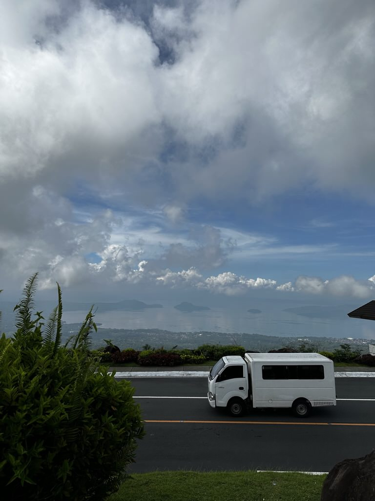
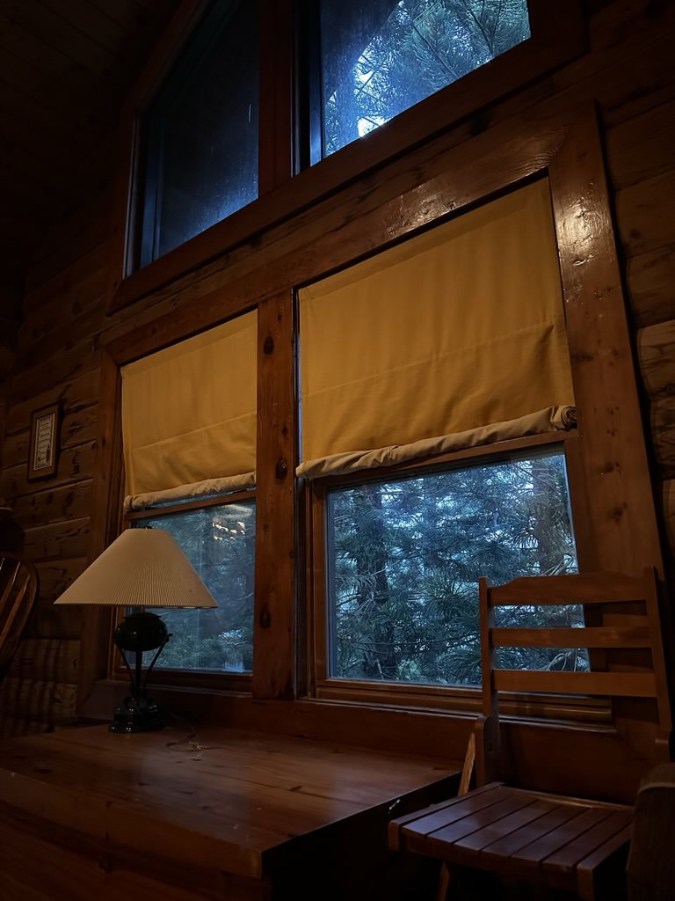
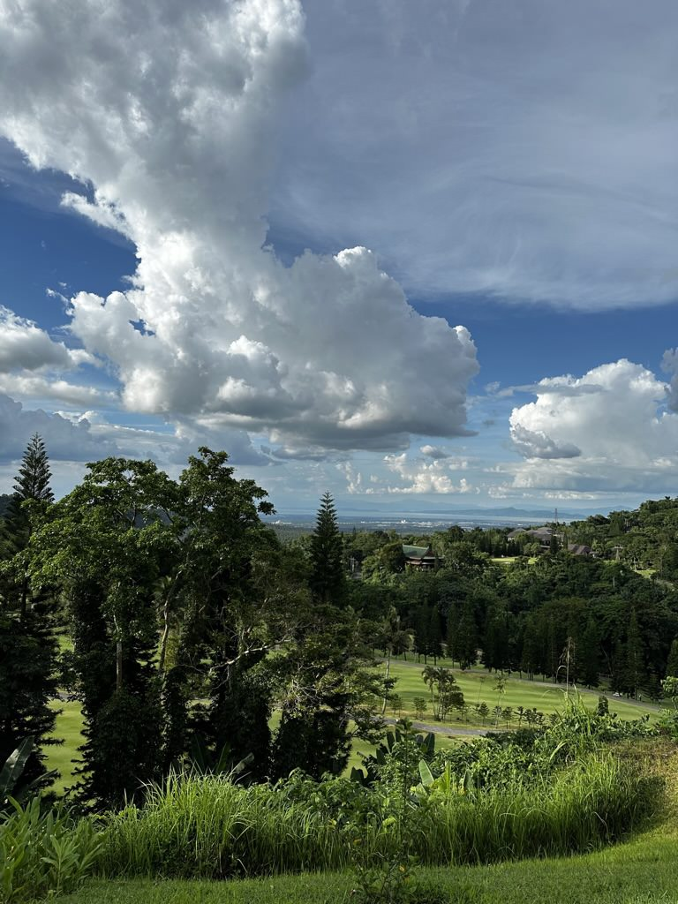
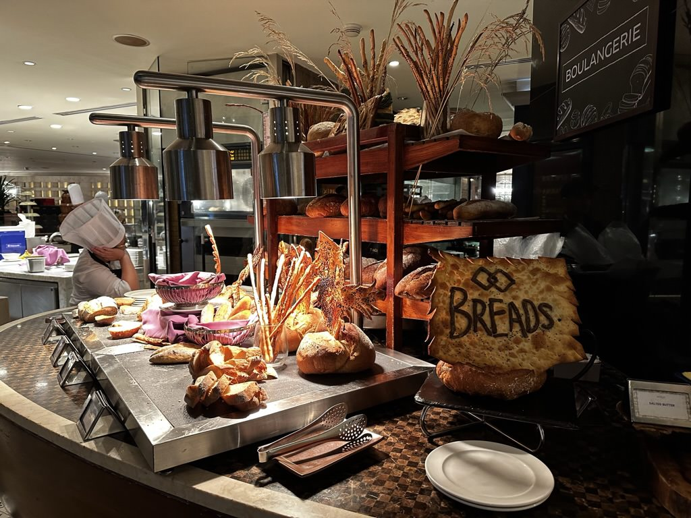

<body>
  <h1>A Gallery</h1>
  
A collection of images that I took from a trip

   
   
  <h2>Philippines</h2>
  
  
Bruno was dancing, showing off to the crowd in his iconic way. Hitting poses and stealing hearts, it was an unforgettable night.

   
   
  
  
Fun fact, Taal is the smallest active volcano in the world. It actually erupted recently, just a little over a year ago.

   
   
  
  
It was simple, calm, and fun. I definitely would go again but probably won't be able to for a very long time.

   
   
  
  
It was probably one of the fanciest hotels I've been to, besides the fact that they only had one employee working the restaurant at night so it took an hour to get our food.

   
   
  
  
I remember telling everyone that I was with "Guys, look at the sleping cat, it's so cute!"

   
   
  
  
Me and my sister went out onto the deck and thought "Woah we should take some pictures" and this was the result

   
   
  
  
My cousin took this on my phone but I thought it was too cool to leave out, so I decided to keep it in here.

   
   
  
  
There's a restaurant just outside the frame of the photo that we were going to eat at and I saw this garden/path and thought it was pretty.

   
   
  
  
This place was so beautiful, you could take a picture of anything and it would've turned out pretty.

   
   
  
  
This buffet is considered to be the fanciest buffet in the Philippines, and I agree with it. There were so many options from so many different cultures, I was absolutely stuffed afterwards.

   
   
  <h2>Japan</h2>
  
  
This was closer to the end of our tour before we went shopping, there were lots of buff guys pulling people around in carts.

   
   
  
  
</body>
